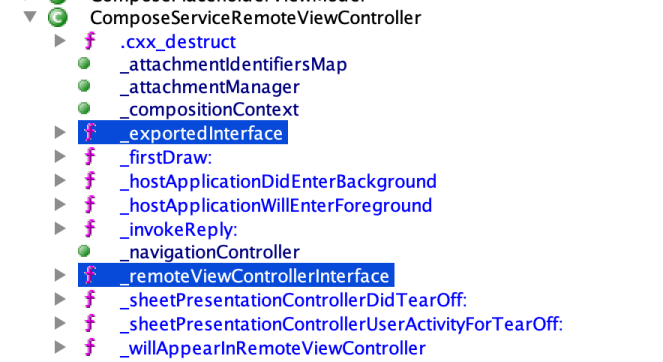

# Making a UIView Service

This is an article about how I made my own UIView service **on iOS 13.4.1**. By the time you read this, this article might be out of date. This article contains both my successful and failed attempts. **This is not a step-by-step guide.**

## Definitions

**UIView Service:** A process on iOS that serves remote view controllers.

**Remote View Controllers:** A remote view controller (`_UIRemoteViewController`) represents a view controller that is displayed on your process while actually being located in a UIView service. This is a private API that was introduced with iOS 6 and its main purpose is to prevent user applications from having access to private data. For example, when you create an `MFMailComposeViewController`, you are actually creating a remote view controller. The view is still displayed in your own application, but the view controller object is not available in your application. This means that you cannot directly extract private information from that view controller, such as user's email address.

**Remote Views:** Remote views (`_UIRemoteView`) are the view objects inside of remote view controllers. We don't really need to think about these.

**iOS Tweak:** This is a term used by people who jailbreak iOS devices. An iOS tweak is a shared library that is loaded into other processes by a process such as Cydia Substrate's `substrated`. These libraries are used to customize the behavior of a lot of things by using Objective-C runtime functions to modify the implementations of methods. This is a term that is unrelated to remote view controllers.

## Introduction

Recently, I decided to use remote view controllers in my iOS tweak. I knew about these view controllers thanks to [an article by Ole Begemann](https://oleb.net/blog/2012/10/remote-view-controllers-in-ios-6/). You should read it too if you haven't read it.

At first, I thought making my own UIView service would've been an easy task. These view controllers have existed since iOS 6, so there has to be some examples and articles online, right? Nope. That article I linked is apparently the only public article about remote view controllers. So, I decided to research them further.

## Looking at different UIView services

I decided to start by looking at different UIView services located inside of `/Applications`. Specifically, I looked at `MusicUIService.app`, `PassbookUIService.app` and `MailCompositionService.app`. Here's what they have in common.

**Shared Info.plist values**  
```xml
<key>CanInheritApplicationStateFromOtherProcesses</key>
<true/>
<key>UIViewServiceUsesNSXPCConnection</key>
<true/>
<key>SBAppTags</key>
<array>
  <string>hidden</string>
</array>
<key>SBMachServices</key>
<array>
  <string>com.apple.uikit.viewservice.[bundle identifier]</string>
</array>
<key>CAProcessCanAccessGPU</key> <!-- This could be unrelated but I'm not sure -->
<true/>
```

**Shared entitlements**  
```xml
<!-- Common entitlements -->
<key>com.apple.private.security.container-required</key>
<true/>
<key>platform-application</key>
<true/>

<!-- Important entitlement -->
<key>com.apple.UIKit.vends-view-services</key>
<true/>
```

## First attempt

With the information I had, I decided to try creating a new UIView service. I quickly created a new Theos projects with two applications. One for testing the service and one for the service itself.

```
* project
|-* testapp
| |-* Resources
| | '-* Info.plist
| |-* Makefile
| |-* entitlements.xml
| |-* main.m
| |-* TESTAppDelegate.h
| |-* TESTAppDelegate.m
| |-* TESTRootViewController.h
| '-* TESTRootViewController.m
|-* testservice
| |-* Resources
| | '-* Info.plist
| |-* Makefile
| |-* entitlements.xml
| |-* main.m
| |-* SERVAppDelegate.h
| |-* SERVAppDelegate.m
| |-* SERVRootViewController.h
| '-* SERVRootViewController.m
|-* layout/DEBIAN
| '-* postinst
|-* Makefile
'-* Headers.h
```

`TESTRootViewController.m` attempts to connect to the service with the following lines:  
```objc
[_UIRemoteViewController
  requestViewController:@"SERVRootViewController"
  fromServiceWithBundleIdentifier:@"com.pixelomer.testservice"
  connectionHandler:^(_UIRemoteViewController *vc, NSError *err){
    void(^blockForMain)(void) = ^{
      if (vc) [self presentViewController:vc animated:YES completion:nil];
      else {
        UIAlertController *alert = [UIAlertController
          alertControllerWithTitle:@"Error"
          message:err.description
          preferredStyle:UIAlertControllerStyleAlert
        ];
        [self presentViewController:alert animated:YES completion:nil];
      }
    };
    if ([NSThread isMainThread]) blockForMain();
    else dispatch_async(dispatch_get_main_queue(), blockForMain);
  }
];
```

Unfortunately, this does not work. Instead of a view controller, we get an error.  
```
_UIViewServiceInterfaceErrorDomain (error code 0)
Un-trusted clients may not open applications in the background.
```

I'm still not sure why I get an error like that. To continue this experiment, instead of a test app, I decided to make a tweak that hooks SpringBoard. So the project now looks like this:  
```
* project
|-* testtweak
| |-* Makefile
| |-* testtweak.plist
| |-* Tweak.x
|-* testservice
| |-* Resources
| | '-* Info.plist
| |-* Makefile
| |-* entitlements.xml
| |-* main.m
| |-* SERVAppDelegate.h
| |-* SERVAppDelegate.m
| |-* SERVRootViewController.h
| '-* SERVRootViewController.m
|-* layout/DEBIAN
| '-* postinst
|-* Makefile
'-* Headers.h
```

This time, our service is launched. However, we still cannot connect to it. Instead, we get an error.
```
_UIViewServiceInterfaceErrorDomain (error code 2)
Attempt to aquire assertions for com.pixelomer.testservice failed
```

## A dive into the headers

When I first saw the error seen above, I was stuck for a while. After trying a few other things, I decided to go back to the headers, specifically [\_UIRemoteViewController.h](https://developer.limneos.net/?ios=13.1.3&framework=UIKitCore.framework&header=_UIRemoteViewController.h). In our case, instance methods are irrelevant since we aren't getting an instance anyway. So, I focused on class methods.  
```objc
+(id)exportedInterface;
+(BOOL)_shouldSendLegacyMethodsFromViewWillTransitionToSize;
+(BOOL)_shouldForwardViewWillTransitionToSize;
+(id)serviceViewControllerInterface;
+(id)requestViewControllerWithService:(id)arg1 connectionHandler:(/*^block*/id)arg2 ;
+(id)requestViewController:(id)arg1 fromServiceWithBundleIdentifier:(id)arg2 connectionHandler:(/*^block*/id)arg3 ;
+(BOOL)__shouldHostRemoteTextEffectsWindow;
+(id)_requestViewController:(id)arg1 traitCollection:(id)arg2 fromServiceWithBundleIdentifier:(id)arg3 service:(id)arg4 connectionHandler:(/*^block*/id)arg5 ;
+(BOOL)shouldPropagateAppearanceCustomizations;
+(BOOL)__shouldAllowHostProcessToTakeFocus;
+(id)requestViewController:(id)arg1 traitCollection:(id)arg2 fromServiceWithBundleIdentifier:(id)arg3 connectionHandler:(/*^block*/id)arg4 ;
+(id)requestViewControllerWithService:(id)arg1 traitCollection:(id)arg2 connectionHandler:(/*^block*/id)arg3 ;
```

From the methods above, only two methods looked interesting: `+exportedInterface` and `+serviceViewControllerInterface`. I decided to call these methods using [FLEX](https://github.com/Flipboard/FLEX). `_UIRemoteViewController` returned null for these methods but when I tried calling them in `MFMailComposeRemoteViewController`, a subclass of `_UIRemoteViewController`, they returned two separate instances of `NSXPCInterface` with two different protocols. Investigating those protocols reveals that the protocol in `+exportedInterface` contains some methods of the client and the protocol in `+serviceViewControllerInterface` contains some methods of the server. You can think of these objects as header files.

I decided to implement these methods myself, so I subclassed `_UIRemoteViewController` like this:  
```objc
// NSXPCInterface is public API, yet the headers don't have it...
@interface NSXPCInterface : NSObject
+ (instancetype)interfaceWithProtocol:(Protocol *)protocol;
@end

// Service
@protocol SERVRootViewControllerRemoteService
- (instancetype)init;
@end

// Client
@protocol SERVRootViewControllerRemoteHost
@end

@interface SERVRemoteRootViewController : _UIRemoteViewController
+ (NSInvocation *)requestViewControllerWithConnectionHandler:(void(^)(SERVRemoteRootViewController *, NSError *))block;
@end

%subclass SERVRemoteRootViewController : _UIRemoteViewController

%new
+ (NSInvocation *)requestViewControllerWithConnectionHandler:(void(^)(SERVRemoteRootViewController *, NSError *))block {
	return [self
		requestViewController:@"SERVRootViewController"
		fromServiceWithBundleIdentifier:@"com.pixelomer.testservice"
		connectionHandler:(void(^)(id,id))block
	];
}

+ (NSXPCInterface *)exportedInterface {
	return [NSXPCInterface interfaceWithProtocol:@protocol(SERVRootViewControllerRemoteHost)];
}

+ (NSXPCInterface *)serviceViewControllerInterface {
	return [NSXPCInterface interfaceWithProtocol:@protocol(SERVRootViewControllerRemoteService)];
}

%end
```

However, this still did not work. However, this time, I got an error about an interrupted connection instead of a client error. So, I decided to take a look at one of the built-in services.

## Checking out MailCompositionService

MailCompositionService is an application that hosts the content for `MFMailComposeViewController`. I decided to copy that app from my phone to my computer for disassembly. It's a small binary, and decompilation took a few seconds. Apparently, a class-dump would've been enough though. While looking at the methods, I immediately noticed `+_exportedInterface` and `+_remoteViewControllerInterface`.



When I saw this, I decided to add the following into the implementation of SERVRootViewController (class in the service).  
```objc
+ (NSXPCInterface *)_exportedInterface {
	return [NSXPCInterface interfaceWithProtocol:@protocol(SERVRootViewControllerRemoteService)];
}

+ (NSXPCInterface *)_remoteViewControllerInterface {
	return [NSXPCInterface interfaceWithProtocol:@protocol(SERVRootViewControllerRemoteHost)];
}
```

Recompiled and installed it and surprisingly it works! I can now see the view controller from the service process inside of SpringBoard!

## Other things

You can add a method that exists on the service method to the server protocol. After doing so, you can call that method like this:  
```objc
@protocol SERVRootViewControllerRemoteService
-(instancetype)init;
-(void)myMethod:(NSString*)arg1;
@end

/* ... */

[vc.serviceViewControllerProxy performSelector:@selector(myMethod:) withObject:@"Testing"];
```

The return value of the methods you call using this proxy must return either `void` or `NSProgress *`. Any other type will cause an exception to be raised.
